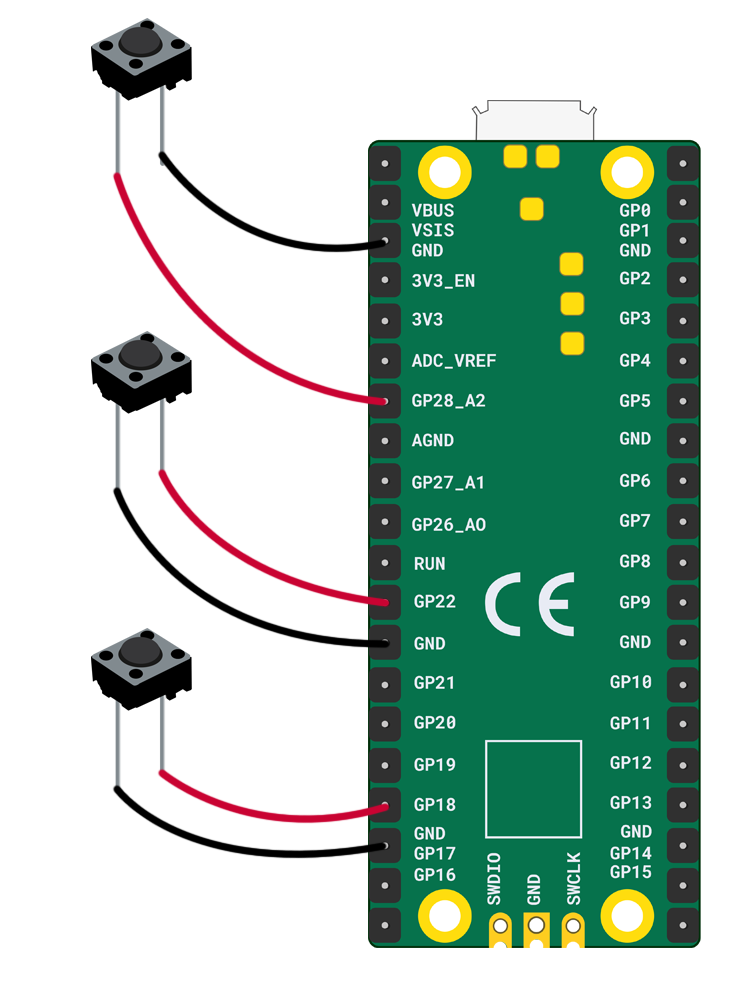

Je hebt nodig:

+ Een Raspberry Pi Pico
+ 2 x pin-bus verbindingsdraden voor elke knop
+ Het aantal door jou gekozen knoppen

**Opmerking:** Dit diagram toont **drie** drukknoppen die aan de Raspberry Pi Pico zijn bevestigd. Als je een **vierde** knop wilt, dan moet je deze aan een **GP** pin en een **GND** aan de rechterkant bevestigen.

+ Bevestig twee pin-bus verbindingsdraden aan **GP18** en de dichtstbijzijnde **GND**
+ Bevestig twee pin-bus verbindingsdraden aan **GP22** en de dichtstbijzijnde **GND**
+ Bevestig twee pin-bus verbindingsdraden aan **GP28** en de dichtstbijzijnde **GND**

